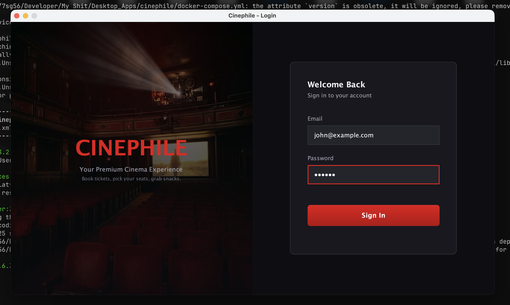
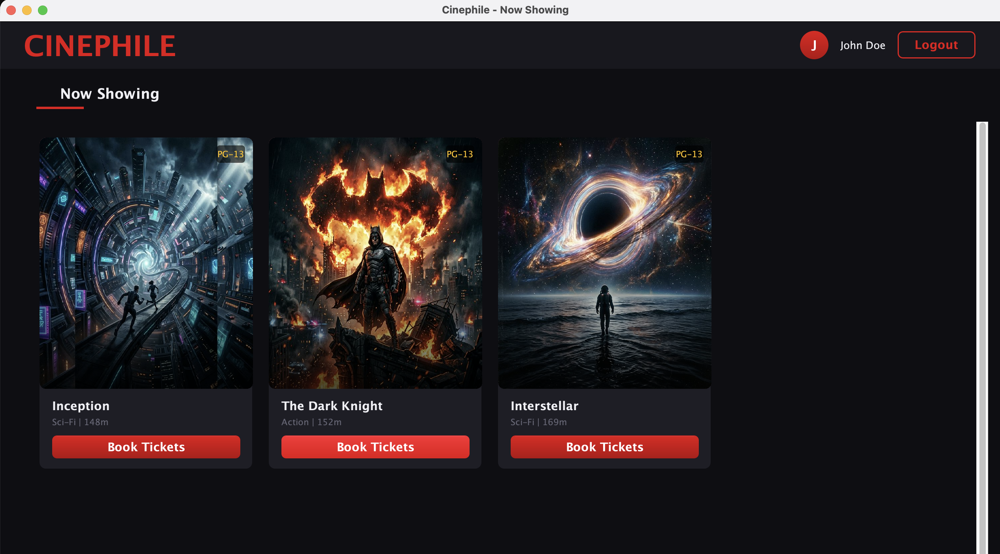

# 🍿 Cinephile

A modern, production-ready desktop application for cinema management and ticket booking, built with **Java Swing** and **MySQL**.

Cinephile provides a premium, dark-themed user experience for moviegoers to browse films, select seats, order snacks, and generate PDF tickets. It also includes an administrative dashboard for managing the movie catalog and viewing booking statistics.

## ✨ Features

### Client Experience

* **Cinematic UI**: A sleek, dark-mode design system with custom-painted components, gradient overlays, and hover animations.
* **Secure Authentication**: Role-based login system for clients and administrators.
* **Interactive Booking Flow**:
  * **Seat Selection**: Visual seat map with tiered pricing (Premium, Executive, Standard) and real-time availability.
  * **Food & Beverage**: Add amenities like popcorn and drinks to your cart with a modern grid layout and quantity steppers.
  * **Payment & Receipt**: Seamless checkout process that auto-generates a downloadable PDF ticket/receipt.

### Admin Dashboard

* **Overview Stats**: Quick insights into total bookings, active movies, and revenue.
* **Movie Management**: Add, view, and manage movie listings in the catalog.

## 🛠️ Technology Stack

* **Language**: Java 17+
* **GUI Framework**: Java Swing (with custom `Graphics2D` rendering to bypass macOS LAF limitations)
* **Build Tool**: Maven
* **Database**: MySQL
* **PDF Generation**: iText (OpenPDF / iText 5)

## 📸 Screenshots

*(Create a `screenshots/` directory and place images here to display them)*

<p float="left">
  
  
</p>

## 🚀 Getting Started

### Prerequisites

1. **Java Development Kit (JDK) 17** or higher.
2. **Apache Maven** installed.
3. **MySQL Server** running locally or remotely.

### Database Setup

1. Create a new MySQL database named `cinephile`.
2. Execute the `schema.sql` file located in the project root to create the necessary tables and insert default amenities/admin users.
3. Update the database credentials in `src/main/java/com/cinephile/util/DatabaseConfig.java` to match your local MySQL configuration.

```java
private static final String URL = "jdbc:mysql://localhost:3306/cinephile";
private static final String USER = "your_username";
private static final String PASSWORD = "your_password";
```

### Building and Running

Clone the repository and build the project using Maven:

```bash
# Clean and compile the project
mvn clean compile

# Run the application
mvn exec:java -Dexec.mainClass="com.cinephile.CinephileApplication"
```

Alternatively, you can build a runnable JAR:

```bash
# Package the application into a JAR
mvn package

# Run the JAR
java -jar target/cinephile-1.0-SNAPSHOT.jar
```

## 🎨 UI/UX Design Notes

This project implements a highly customized design system on top of Java Swing. To achieve a modern look (especially on macOS where standard `JButton` styling is often restricted), the application makes heavy use of custom `paintComponent` overrides. Highlights include:

* **`ModernButton`**: Custom gradients, hover glows, and press-offset animations. Text is drawn manually to prevent native LAF truncation.
* **`StepIndicatorPanel`**: A custom-drawn progress bar for the multi-step booking flow.
* **`RoundedPanel`**: Custom clipping for smooth, anti-aliased rounded corners and optional borders.

---
*Developed as a premium Java desktop application showcase.*
